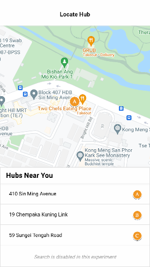
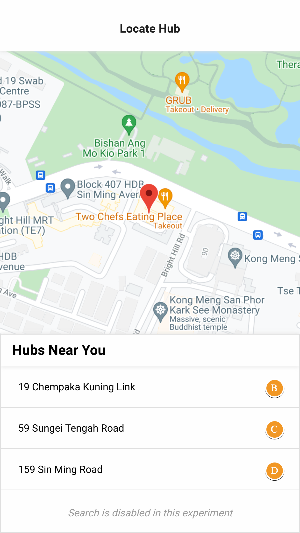
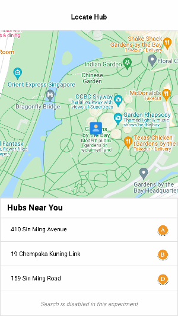

Vue Map Challenge (challenge-vue-map)
=====
[](https://github.com/hungluu/challenge-vue-map/actions/workflows/release-site-test-manual.yml)

A map built with VueJS

**Table of Contents**
* [Technologies](#technologies)
* [Previews](#previews)
* [Development](#development)
  + [Setup local](#setup-local)
  + [Start development](#start-development)
  + [Folder structure](#folder-structure)
  + [Customize configuration](#customize-configuration)
* [Deployment](#deployment)
  + [Build production](#build-production)
  + [Deploy to firebase](#deploy-to-firebase)
* [Contribution](#contribution)

Technologies
-----
- [VueJS v3](https://v3.vuejs.org) SPA with [Quasar v2](https://quasar.dev)
- [Google Maps API](https://developers.google.com/maps/documentation/javascript/overview)
- [Github Actions](https://github.com/features/actions) for deployment to [Firebase Hosting](https://firebase.google.com/docs/hosting)

Previews
----
A demo website can be accessed at https://vue-map-0921.web.app (Tested with Chrome on laptop and phone)

Here are some screenshots

<table border="0">
 <tr>
    <td>
      
    </td>
    <td></td>
    <td></td>
 </tr>
 <tr>
  <td align="center">
    Hubs are displayed in list and map
  </td>
  <td align="center">
    Select hubs by clicking them on map / list
  </td>
  <td align="center">
    Detect user location to sort hubs by distances
  </td>
 </tr>
</table>


Development
----
### Setup local

- Please run this command to install required dependencies
  ```
  yarn
  ```
- Create an `.env` in your project folder (beside `.env.example`) with your [Google API key](https://console.cloud.google.com/apis/credentials) (with Maps JS, Geocoder permissions)
  ```
  GOOGLE_API_KEY=<api-key>
  ```
### Start development

This command will start a quasar development server, which will also watch your file changes to live-reload
```
yarn start
```

You can preview your changes at http://localhost:8080

### Folder structure

Here is basic structure of source folder, which I regrouped some components from quasar's default boilerplate for ease of maintenance in a modular way:

```
src
 |- assets  // App assets
 |- config
     |- router    // Routes & router config
     |- store     // Store config
     |- index.ts  // Some other static config
 |- hubs    // Components for hub list & map
 |- lib     // Libraries
     |- errors    // Error pages
     |- layouts
     |- ...
 |- services      // Error pages
 |- ...
```
### Customize configuration

See [Configuring quasar.conf.js](https://v2.quasar.dev/quasar-cli/quasar-conf-js).

Deployment
----
### Build production

For a production-ready build of the application, please use this command:
```
yarn build
```

### Deploy to firebase 

There is a Github Actions pipeline defined in `.github` folder for manually one-click deployment to Firebase Hosting

Contribution
-----
All contributions are welcomed. Feel free to clone this project, make changes that your feel necessary and pull request anytime you want.


🍻 Cheers.
